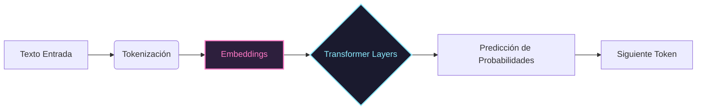
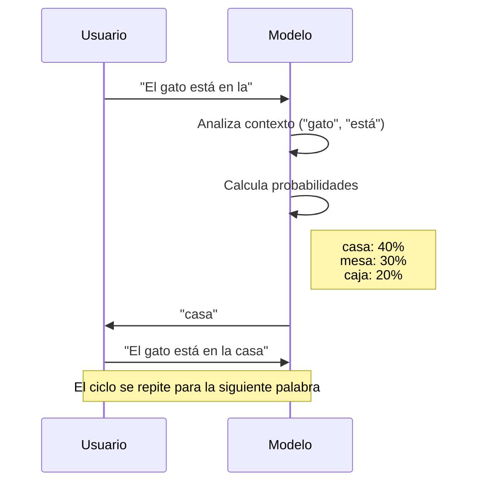

:::homework{id="A.2.1" title="Curso: AI Assisted Coding for Developers" due="2026-01-19" points="20"}

Completa el curso [AI Assisted Coding for Developers](https://app.datacamp.com/learn/courses/ai-assisted-coding-for-developers). La evidencia se sube después en A.5.5 (módulo Git).
Solo se necesitan completar las primeras 2 unidades: 'Unlocking the Power of AI in Code' & 'Prompt Engineering for Real-World Coding Tasks'
:::

# Large Language Models (LLMs)

## Tarea

Para profundizar en el uso de asistentes de IA para programar, completa el siguiente curso:
*   [AI Assisted Coding for Developers](https://app.datacamp.com/learn/courses/ai-assisted-coding-for-developers)  
Asegurate de completar el curso, la idea es que aprendas a hacer prompts en general, no se subira evidencia de esta tarea hasta depues (completando le modulo de github) pero debes completarlo para la siguiente clase por que te sera de gran ayuda en las tareas y en lo que estaremos aprendiendo.  
Solo se necesitan completar las primeras 2 unidades: 'Unlocking the Power of AI in Code' & 'Prompt Engineering for Real-World Coding Tasks'

## ¿Qué son los LLMs?

Un **Large Language Model (LLM)** es un sistema de inteligencia artificial diseñado para entender, generar y manipular lenguaje humano. Imagina un LLM como un "autocompletar" extremadamente avanzado: ha leído casi todo internet (libros, artículos, código) y ha aprendido patrones estadísticos sobre cómo se relacionan las palabras entre sí.

No "piensan" como los humanos; en su lugar, calculan la probabilidad de qué palabra (o fragmento de palabra) debería seguir a la anterior basándose en el contexto.

## Conceptos Fundamentales

Para entender cómo funcionan, necesitamos definir algunos términos clave:

### 1. Token
Los LLMs no leen palabras completas, leen **tokens**. Un token puede ser una palabra entera, parte de una palabra o incluso un espacio.
*   Ejemplo: "Inteligencia" $\rightarrow$ `Inteli` + `gencia` (2 tokens).
*   Aproximadamente, 1000 tokens son unas 750 palabras.

### 2. Embedding
Es la traducción de tokens a números que la computadora puede entender.
*   Cada token se convierte en una lista larga de números (un vector).
*   Tokens con significados similares (ej. "rey" y "reina") tendrán números (vectores) matemáticamente cercanos en este espacio multidimensional.

### 3. Encoder y Decoder (Arquitectura Transformer)
La mayoría de los LLMs modernos se basan en la arquitectura **Transformer**:
*   **Encoder (Codificador):** Procesa el texto de entrada y lo comprime en una representación matemática que captura su significado y contexto. (Entiende lo que lee).
*   **Decoder (Decodificador):** Toma esa representación y genera texto nuevo, prediciendo el siguiente token paso a paso. (Escribe la respuesta).

Algunos modelos usan solo Encoder (BERT), solo Decoder (GPT) o ambos (T5).

## ¿Cómo funcionan? (Predicción de Siguiente Token)

El proceso básico es iterativo. El modelo recibe tu texto, predice el siguiente token más probable, lo añade a tu texto y repite el proceso.

## Prompt Engineering

El **Prompt Engineering** es el arte de diseñar tus entradas (prompts) para guiar al modelo a darte la mejor respuesta posible. Como los LLMs son probabilísticos, la forma en que pides las cosas cambia drásticamente el resultado.

### Técnicas Básicas

#### 1. Zero-shot Prompting
Pedirle al modelo que haga algo sin darle ejemplos previos. Confías en su conocimiento general.
> *Prompt:* "Clasifica este texto como positivo o negativo: 'La comida estuvo deliciosa'."
>
> *Respuesta:* "Positivo"

#### 2. Few-shot Prompting
Darle al modelo uno o más ejemplos de lo que quieres para que entienda el patrón.
> *Prompt:*
> "Sigue el formato:
> Fruta: Rojo -> Manzana
> Fruta: Amarillo -> Plátano
> Fruta: Morado ->"
>
> *Respuesta:* "Uva"

#### 3. Chain of Thought (Cadena de Pensamiento)
Pedirle al modelo que explique su razonamiento paso a paso antes de dar la respuesta final. Esto mejora mucho la precisión en problemas lógicos o matemáticos.
> *Prompt:* "Si tengo 5 manzanas, como 2 y compro 3 más. ¿Cuántas tengo? Piensa paso a paso."
>
> *Respuesta:*
> "1. Empiezas con 5 manzanas.
> 2. Comes 2, así que 5 - 2 = 3.
> 3. Compras 3 más, así que 3 + 3 = 6.
> Respuesta final: 6 manzanas."

## Capacidades de Búsqueda y Código

Además de generar texto, las herramientas modernas de LLM tienen capacidades extendidas muy potentes.

### Search y Deep Search

Los LLMs tienen una fecha de corte de conocimiento (ej. lo que sabían hasta 2023). Para superar esto, usamos herramientas de búsqueda:

*   **Search (Búsqueda Web):** El modelo usa un buscador (como Bing o Google) para obtener información en tiempo real. Útil para noticias, documentación técnica reciente o datos del clima.
*   **Deep Search / Deep Research:** El modelo realiza una investigación iterativa. No solo busca una vez, sino que plantea una estrategia, busca, lee resultados, refina su búsqueda y sintetiza la información de múltiples fuentes. Es ideal para temas complejos que requieren profundidad.

### Uso de LLMs para Programación

Los LLMs son increíblemente útiles como asistentes de código (Copilots). Aquí algunas formas de usarlos:

1.  **Generación de Código:** Pídele funciones específicas.
    *   *Tip:* Dale contexto. En lugar de "haz un botón", di "haz un componente Button en React con TypeScript que acepte una prop `variant`".
2.  **Explicación:** Si no entiendes un bloque de código, pégalo y pide una explicación línea por línea.
3.  **Debugging:** Cuando tengas un error, copia el error Y el código relevante. El modelo suele encontrar la causa rápidamente.
4.  **Refactorización:** Pide al modelo que mejore la legibilidad o eficiencia de tu código existente.
5.  **Conversión:** Pídele que traduzca código de un lenguaje a otro (ej. de Python a JavaScript).
