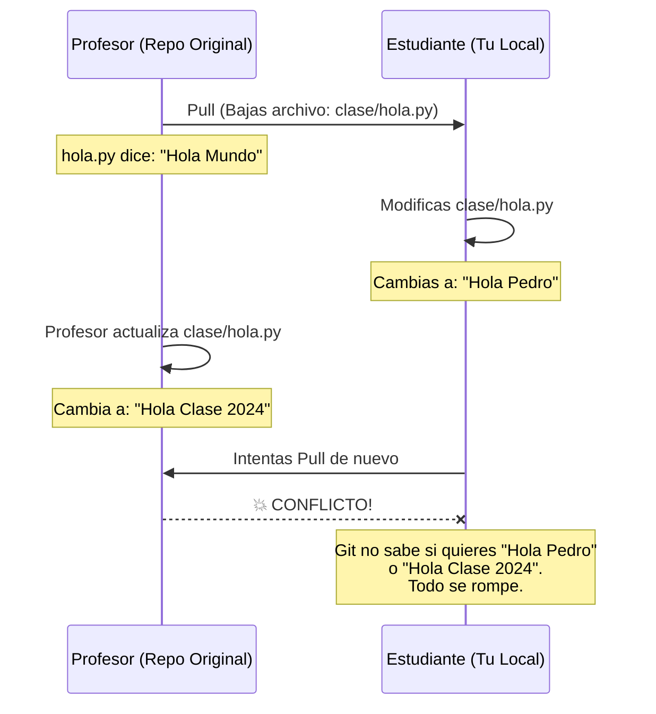
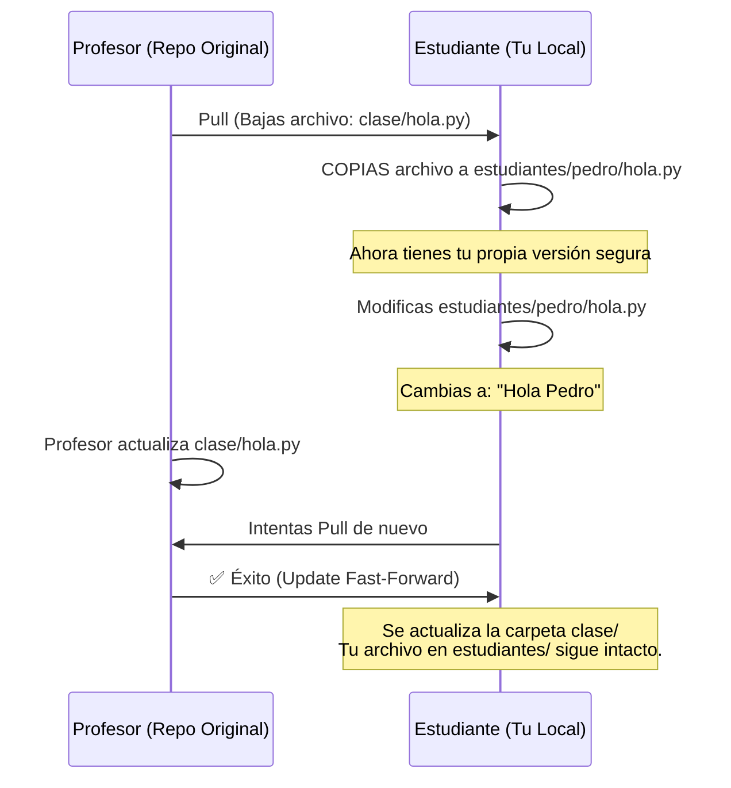

:::homework{id="A.5.2" title="Fork y Clone del repositorio" due="2026-01-26" points="0"}

Haz Fork del repositorio del curso, clónalo a tu máquina y configura el remote `upstream`. Crea tu carpeta personal en `estudiantes/tu_usuario/`.

:::

# Estructura del Curso y Tu Carpeta Personal

Para este curso, trabajaremos de una manera muy específica para simular un entorno profesional y evitar conflictos de código. Este documento explica **dónde** puedes escribir y **dónde está prohibido**.

## Diagrama Mental del Flujo

Este diagrama resume cómo fluye la información entre el profesor y tú sin chocar.

```mermaid
graph TD
    A[Profesor Repo] -->|Pull (Sincronizar)| B[Tu Repo Local];
    B -->|Copia Archivo| C{Tu Carpeta Personal};
    D[Zona Prohibida 'clase/'] -.->|Solo Lectura| B;
    C -->|Edit & Commit| E[Tu Rama];
    E -->|Push| F[Tu GitHub Fork];
    F -->|Pull Request| A;
    style C fill:#9f9,stroke:#333
    style D fill:#f99,stroke:#333
```

---

## La Regla de Oro: `estudiantes/{tu_usuario}`

El repositorio tiene una estructura estricta dividida en dos mundos:

1.  🔴 **Zona Prohibida (`clase/`):** Aquí subo yo (el profesor) el material. Si modificas algo aquí, romperás tu repositorio al intentar actualizar.
2.  🟢 **Zona Segura (`estudiantes/tu_usuario/`):** Aquí es donde vives tú. Puedes crear, borrar y destruir lo que quieras aquí.

### Diagrama de la Estructura

```text
ia_p26/ (Raíz del Proyecto)
├── .gitignore
├── README.md
├── clase/                  <-- 🔴 PROHIBIDO TOCAR (Solo lectura)
│   ├── semana01/
│   │   ├── ejemplo_a.py
│   │   └── notas.md
│   └── ...
└── estudiantes/            <-- 🟢 TU ZONA DE TRABAJO
    ├── uumami/           <-- ✅ TU CARPETA (Safe Zone)
    │   ├── semana01/
    │   │   └── tarea_copia.py
    │   └── mis_notas.txt
    └── maria_dev/          <-- ❌ CARPETA DE OTRO (No tocar)
```

---

## El Concepto de "Mirror" (Espejo)

Como no puedes editar la carpeta `clase/`, ¿cómo trabajas en los ejercicios?
**Respuesta:** Copias y Pegas a tu carpeta.

### Anatomía de una Colisión (Por qué fallamos)

Imagina que el profesor sube el archivo `clase/semana1/calculadora.py` que tiene errores y debes arreglar.

#### ❌ Lo que NO debes hacer (Colisión Segura)



**Explicación:**
1.  Abres `clase/semana1/calculadora.py`.
2.  Arreglas el código ahí mismo.
3.  Guardas.
4.  Mañana el profesor actualiza `calculadora.py` con una mejora.
5.  Cuando hagas `git pull upstream main`, Git te gritará: **CONFLICTO**. Tu versión choca con la del profesor. Tendrás que borrar tu trabajo o sufrir arreglando el conflicto manual.

#### ✅ Lo que SÍ debes hacer (El Camino del Éxito)



**Explicación:**
1.  Lees el archivo en `clase/semana1/calculadora.py`.
2.  **Copias** el archivo a `estudiantes/tu_usuario/semana1/calculadora.py`.
3.  Editas y resuelves el problema en **TU COPIA**.
4.  Subes tu copia.
5.  El profesor actualiza su archivo original.
6.  Haces `git pull upstream main`.
7.  Git actualiza la carpeta `clase/` sin problemas. Tu archivo en `estudiantes/` permanece intacto y seguro. **Cero conflictos.**

---

## Setup Inicial: Crea tu Espacio

Tu primera misión es crear tu "oficina" dentro del repositorio.

1.  Abre tu terminal en la raíz del proyecto.
2.  Ve a la carpeta de estudiantes:
    ```bash
    cd estudiantes
    ```
3.  Crea una carpeta **EXACTAMENTE** con tu nombre de usuario de GitHub.
    *   Ejemplo: Si tu usuario es `uumami`, tu carpeta debe ser `estudiantes/uumami/`.
    ```bash
    mkdir uumami
    ```
4.  Entra a tu carpeta:
    ```bash
    cd uumami
    ```
5.  Crea un archivo de prueba para que Git detecte la carpeta (Git ignora carpetas vacías):
    ```bash
    touch .gitkeep
    ```

---

## Setup del Repositorio (Fork y Clone)

Sigue estos pasos con cuidado. Usaremos el repositorio oficial de la clase: `https://github.com/sonder-art/ia_p26`

### 1. Fork (Bifurcación)
**Paso Crítico:** No trabajaremos directamente sobre mi repositorio, sino sobre una copia tuya vinculada al mío.

1.  Ve a [https://github.com/sonder-art/ia_p26](https://github.com/sonder-art/ia_p26).
2.  Arriba a la derecha, dale click al botón **Fork**.
3.  GitHub te pedirá confirmar el nombre del repositorio.
    *   Puedes dejarlo como `ia_p26` (recomendado).
    *   O puedes ponerle un nombre personalizado (ej. `mi-curso-ia`, `ia-repo-personal`). **Este nombre es tu "placeholder", úsalo cuando veas referencias a tu repo.**
4.  Dale a "Create Fork". Ahora tendrás una copia en `https://github.com/TU_USUARIO/NOMBRE_DEL_FORK`.

### 2. Clone (Clonar)
Ahora bajaremos **TU** copia (tu fork) a tu computadora.

> **Prompt para LLM:**
> "Ya hice un Fork del repositorio. Ahora quiero clonarlo en mi computadora usando SSH.
> 1. ¿Cuál es el comando `git clone` que debo usar para mi repositorio: `git@github.com:[TU_USUARIO]/[NOMBRE_DEL_FORK].git`?
> 2. ¿En qué carpeta me recomiendas organizarlo?"

### 3. Configurar el "Upstream"
Tu computadora sabe que `origin` es TU repositorio (tu fork). Pero necesita saber que existe el repositorio del profesor (`upstream`) para bajar las actualizaciones de la clase.

Ejecuta esto en tu terminal dentro de la carpeta del proyecto:

```bash
git remote add upstream git@github.com:sonder-art/ia_p26.git
```

Para verificar:
```bash
git remote -v
```
Deberías ver 4 líneas:
*   `origin` -> Tu Fork (donde subes tus tareas).
*   `upstream` -> Repo del Profesor (de donde bajas las clases).
