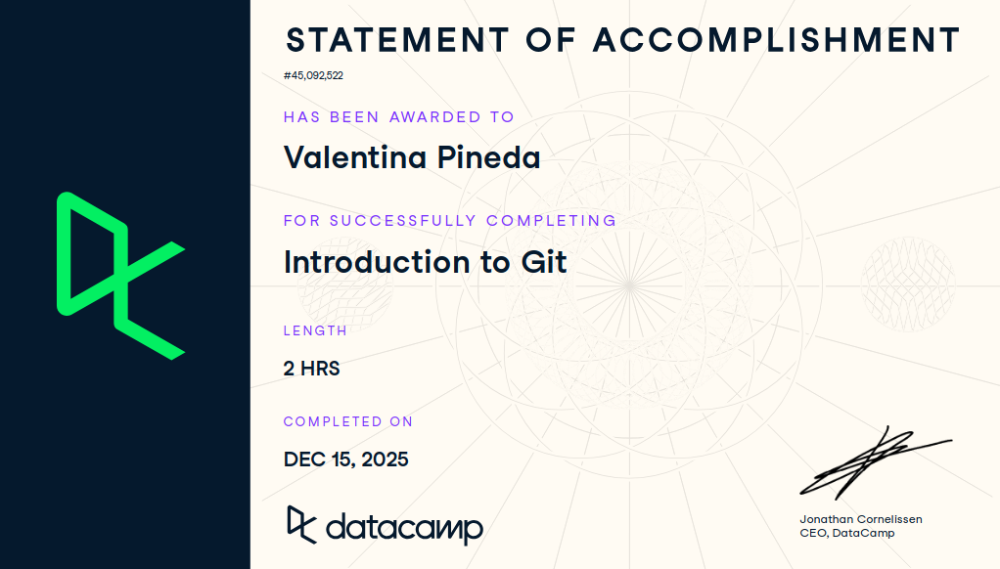

# Plantilla de Entrega

Esta es la plantilla que debes copiar a tu carpeta `estudiantes/tu_usuario/certificaciones/` para entregar la evidencia del curso.

**Curso:** [Introduction to GitHub Concepts](https://app.datacamp.com/learn/courses/introduction-to-github-concepts)

**Requisitos de la evidencia:**
1. El nombre del curso
2. El progreso al 100%
3. Tu usuario logueado

---

# Evidencia: Introduction to GitHub Concepts

Nombre del Estudiante: Valentina Pineda Barrón
Fecha: 15 de diciembre de 2025

## Prueba de Finalización

Por favor, inserta aquí abajo una captura de pantalla clara donde se vea:
1.  El nombre del curso.
2.  El progreso al 100%.
3.  Tu usuario logueado.

```markdown

```

o enlace al certificado público:
[https://www.datacamp.com/completed/statement-of-accomplishment/course/73b1348ade9a5aa19633bc9d313838efff9f2e23]
